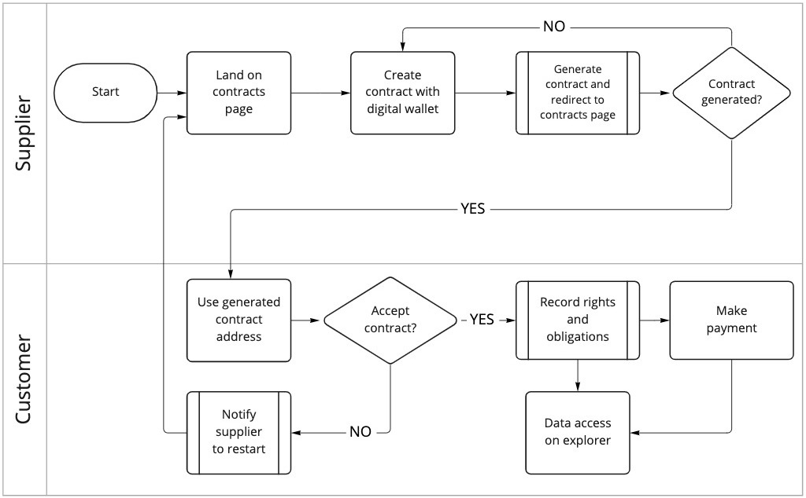

# Recurrent_Transactions

Recurrent Transactions Blockchain Project

Clone the repo to your local working environment
Make sure you have Node.js installed (At least version 14.18.0)
Command to run before running the project

```
cd UI/
npm install --legacy-peer-deps
```

This should install all the packages that is contained under package.json
Make sure you are under UI folder, that is where the frontend application is stored.

After getting all the packages you will need a JavaScript compiler, this project depends on SWC,  
SWC (stands for Speedy Web Compiler) is a super-fast TypeScript / JavaScript compiler

```
npm i -D @swc/cli @swc/core
```
## Backend Setup (Node.js)
The folder named BACKEND is where the backend application is stored.
Create .env file in the backend folder and fill it with the following information

```
cd BACKEND/
touch .env
SERVER_PORT=8080 (Inside the .env file)
DATABASE_PASSWORD='yourpass'
DATABASE_USERNAME='yourusername'
DATABASE_HOST='localhost'
```
Before starting to run the backend server to establish a connection you need to have couple more things installed

You need to have MySQL as a process running in the background as well. You can refer to the link below

- [MySQL Installer](https://dev.mysql.com/downloads/installer/)

To interact and modify the database make sure you have installed MySQL Workbench locally
Refer to this link for more details. 
- [MySQL Workbench](https://dev.mysql.com/downloads/workbench/)

At this step you should already have node and npm installed on the local machine, if not install them as well 
- [NodeJS](https://nodejs.org/en/download/)

Supervisor is always nice to have to ensure the DB connection
- [Supervisor](https://www.npmjs.com/package/supervisor)


The DB is still immature so the table names have to match EXACTLY!

The scheme name has to be: 'recurrent_transactions'
You need to have 2 tables namely 

- proposed_terms
- supplier_proposed_contracts

Here are some pictures to help you understand what the fields are supposed to look like


And then you should able to run these commands to establish a connection!

```
npm install --legacy-peer-deps
supervisor server.js
```
If you do not have supervisor installed you can change the above command to

```
node server.js
```

### In case of an issue with supervisor!

```
mv ~/.npmrc ~/.npmrc.old

npm prefix -g

npm install supervisor -g
```

Be aware that the commands can vary from windows to other OS environments.

## We are almost ready to go!

Go onto a terminal and find your local working environment where this project is installed under UI/ and run

```
npm start
```

# Links onto some resources

- [paper634](https://www.romjist.ro/abstract-634.html)

# How it works?



### Additional Information

There are other instances of the deployment under deploy.js but some contain bugs. I will keep on adding other deployed smart contracts there with more information on the oncoming commits

### Features

- <input type="checkbox" disabled checked /> Generate a contract with proposed terms and conditions
- <input type="checkbox" disabled checked /> Connect MetaMask to the platform
- <input type="checkbox" disabled  /> Have a feature to connect MetaMask so users can have UNIQUE profiles for themselves. (TO-DO)
- <input type="checkbox" disabled  /> An export file in the form of a PDF should be generated. It will make it readable for everyone (TO-DO)
- <input type="checkbox" disabled  /> PDF generator of the contract (TO-DO)
